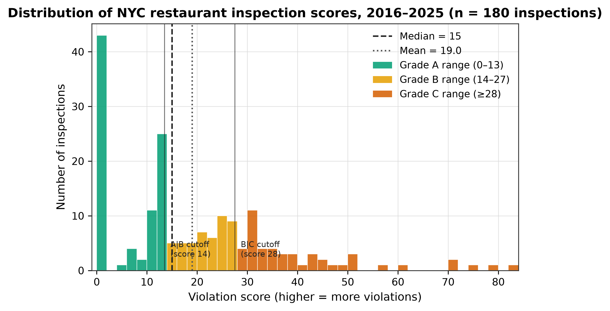
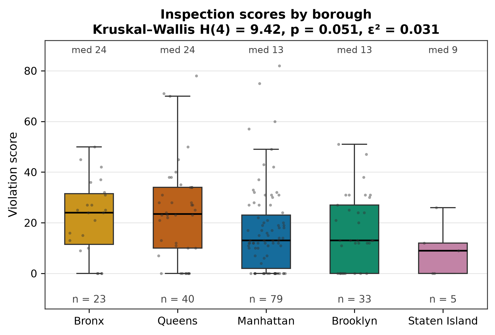
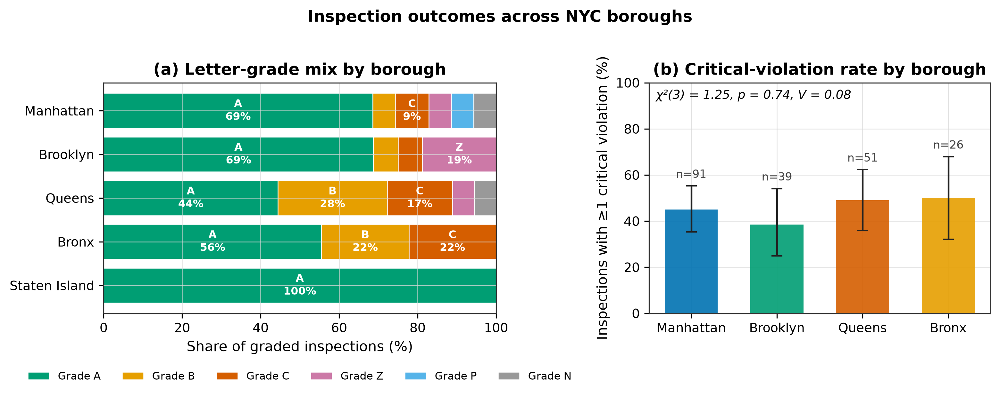
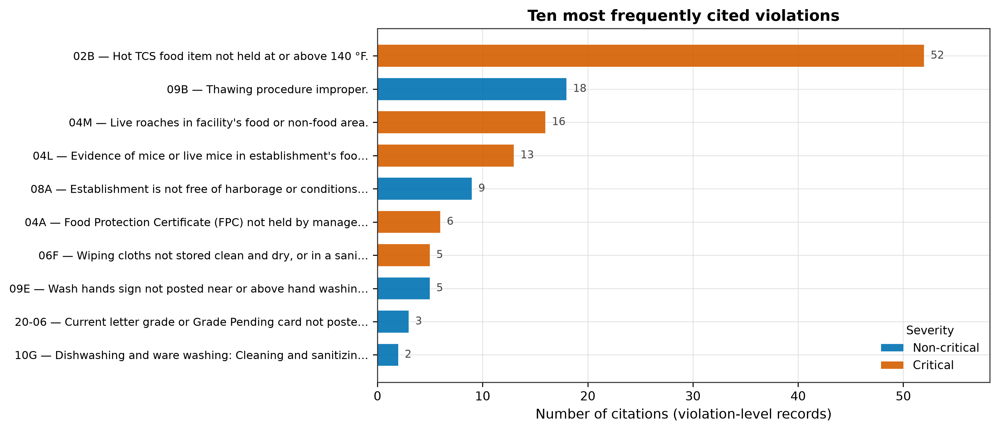
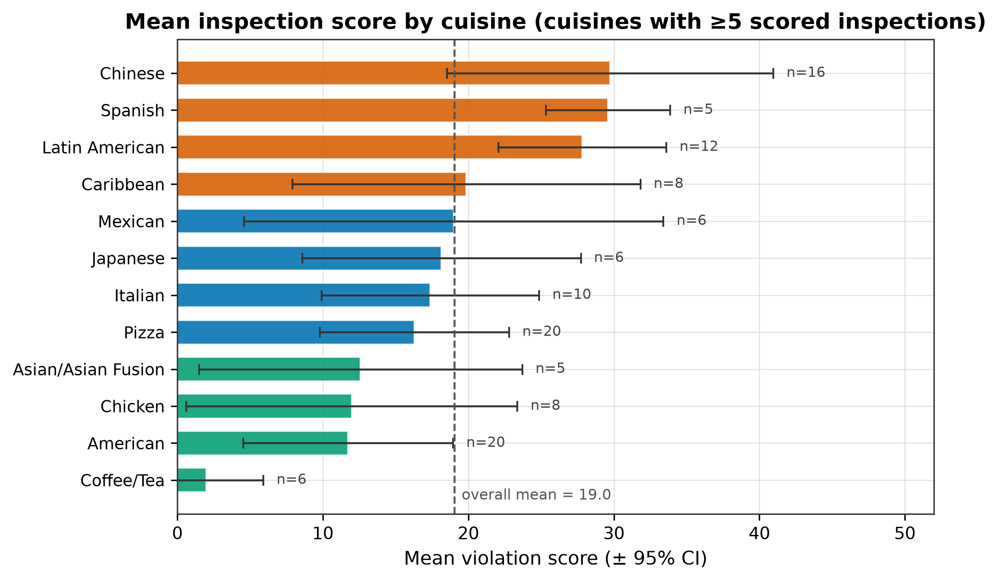
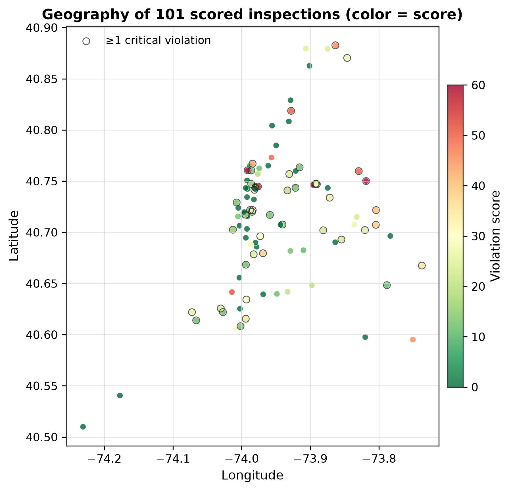
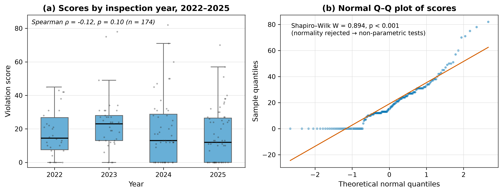
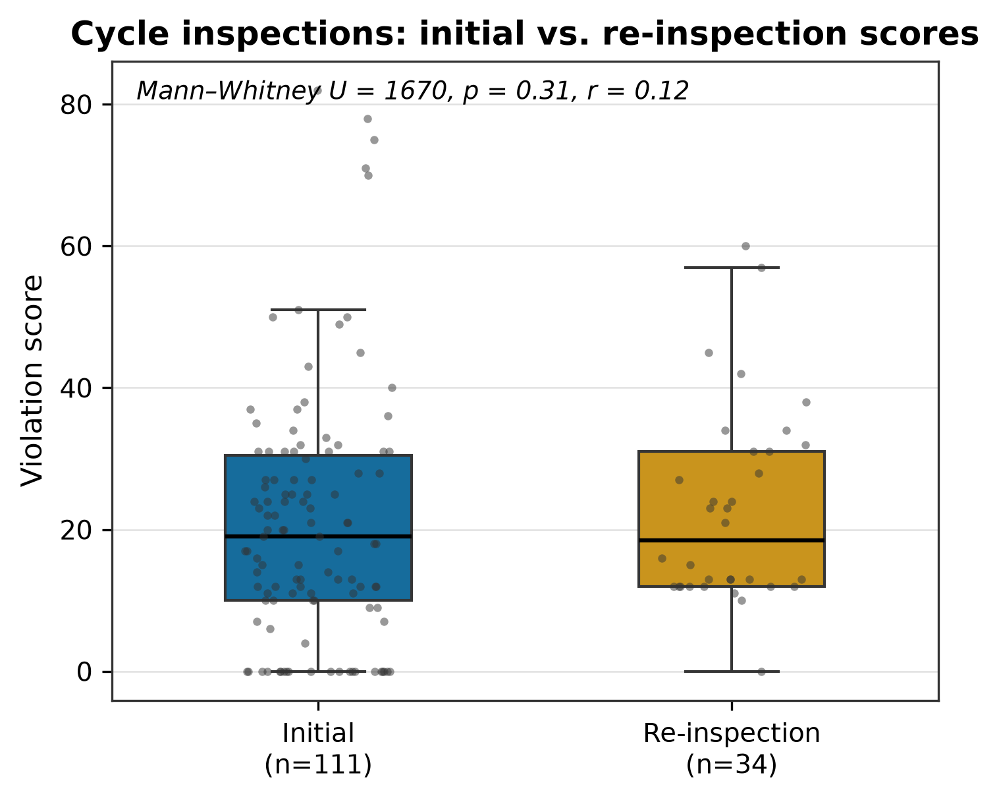

# NYC Restaurant Inspection Data — Statistical Analysis Report

**Dataset:** NYC DOHMH Restaurant Inspection Results, 1,000-row extract (file `43nn-pn8j.csv`), extract date 2025-10-22
**Analysis date:** 2026-09-14 · **Tools:** Python 3 (pandas, SciPy, statsmodels, seaborn) · α = 0.05 throughout

---

## 1. Executive summary

- The extract holds **1,000 violation-level records** covering **212 unique inspections of 195 establishments** (2016-02 – 2025-10); **180 inspections have numeric scores**. The majority of rows (78%) are *pre-permit* records for venues not yet inspected — they contain no inspection data by design.
- Scores are **right-skewed, zero-inflated and non-normal** (median 15, mean 19.0, max 82; Shapiro–Wilk p < 0.001) → non-parametric methods were used for all inferential tests.
- **62.5% of graded inspections received an A**; 45.8% of inspections cited ≥1 critical violation.
- **No statistically significant differences** were found in scores across boroughs (Kruskal–Wallis p = 0.051, small effect ε² = 0.03), between initial and re-inspections (p = 0.31), in critical-violation rates by borough (p = 0.74) or cuisine (p = 0.34), and no temporal trend in scores (ρ = −0.13, p = 0.10).
- The borderline borough signal is driven by Queens/Bronx (median 24) vs. Staten Island/Manhattan/Brooklyn (9–13); with only 5 scored Staten Island inspections the sample is underpowered to confirm it.
- Food-safety hot spots: **cold/hot holding of TCS foods (code 02B)** dominates citations (52, all critical), followed by improper thawing (09B) and pest evidence (04M/04L). Critical-violation counts track total score closely (ρ = 0.46, p < 0.001), validating score as a risk proxy.

---

## 2. Data cleaning

| Issue found | Fix applied |
|---|---|
| `inspection_date = 1900-01-01` sentinel in **781 rows** (DOHMH's "not yet inspected" placeholder) | Set to missing; retained establishments flagged as pre-permit |
| `latitude/longitude = (0, 0)` string zeros (147 rows) | Set to missing after NYC bounding-box validation (0 true outliers) |
| `boro = "0"` (7 rows), `zipcode/building/street = "N/A"` (4–6 rows) | Set to missing |
| `score`, `zipcode`, coordinates stored as text | Converted to numeric; impossible values nulled |
| Phone artifacts (e.g. `646675522_`) | Stripped to digits |
| Cuisine missing (violation-level) | Filled `"Unknown"` |
| Violation descriptions reworded by DOHMH over time | Canonicalised to most frequent wording per code for aggregation |
| Duplicate checks | 0 exact duplicates; 0 duplicate (camis × date × violation_code) rows |

Resulting analysis frames: `cleaned_violations.csv` (1,000 rows) and an inspection-level frame `cleaned_inspections.csv` (212 rows) where score/grade were de-duplicated to one value per (camis × inspection_date).

---

## 3. Descriptive statistics

**Inspection scores (n = 180):** mean = 19.04, SD = 17.06, median = 15, IQR = 6.75–28, range 0–82, skewness = 1.14.

**Scores by borough:**

| Borough | n | Mean ± SD | Median | 95% CI (mean) |
|---|---|---|---|---|
| Bronx | 23 | 22.1 ± 14.8 | 24 | ± 6.0 |
| Brooklyn | 33 | 16.8 ± 14.3 | 13 | ± 4.9 |
| Manhattan | 79 | 16.9 ± 17.0 | 13 | ± 3.7 |
| Queens | 40 | 24.6 ± 19.8 | 23.5 | ± 6.1 |
| Staten Island | 5 | 9.4 ± 10.7 | 9 | ± 9.4 |

**Outcomes:** 69.8% of inspections cited violations; 45.8% included ≥1 critical item. Of 80 graded inspections: A = 50 (62.5%), B = 10, C = 9, Z (pending) = 6, N/P = 5.

**Highest-risk cuisines (mean score, n ≥ 5):** Chinese 29.8 (n=16), Spanish 29.6 (n=5), Latin American 27.8 (n=12) — all above the grade-C threshold of 28 on average; lowest: Coffee/Tea 2.0, American 11.8, Chicken 12.0.

---

## 4. Assumption checks

| Check | Result | Consequence |
|---|---|---|
| Normality of score (Shapiro–Wilk) | W = 0.894, **p < 0.001** (rejected); also rejected within each borough | Use Kruskal–Wallis / Mann–Whitney / Spearman instead of ANOVA / t-test / Pearson |
| Homogeneity of variance (Levene) | W = 0.72, p = 0.579 (not rejected) | ANOVA reported only as sensitivity check |
| Chi-square expected counts (borough × critical) | 0/8 cells < 5 | Chi-square valid |
| Chi-square expected counts (cuisine × critical) | 7/20 cells < 5 | Result treated as exploratory |
| Q–Q plot | Strong right-tail deviation (Fig. 7b) | Confirms non-parametric choice |

---

## 5. Hypothesis tests

| # | Hypothesis | Test | Statistic | p | Effect size | Verdict |
|---|---|---|---|---|---|---|
| H1 | Scores differ across boroughs | Kruskal–Wallis (n=180, 5 groups) | H(4) = 9.42 | **0.051** | ε² = 0.031 (small) | Not significant (borderline) |
| H1′ | sensitivity | One-way ANOVA | F = 2.11 | 0.077 | — | Consistent with H1 |
| H2 | Re-inspections score lower than initial inspections | Mann–Whitney U (111 vs 34, cycle inspections) | U = 1670 | 0.31 | rank-biserial r = 0.12 | Not significant |
| H3 | Critical-violation rate differs by borough | χ² of independence (4 boroughs) | χ²(3) = 1.25 | 0.74 | V = 0.078 | Not significant |
| H4 | Critical-violation rate differs by cuisine | χ² (10 cuisines ≥ 8 inspections) | χ²(9) = 10.13 | 0.34 | V = 0.27 | Not significant (exploratory) |
| H5 | Scores trend over time (2022–2025) | Spearman | ρ = −0.13 | 0.10 | — | Not significant |
| H6 | # critical violations correlate with score | Spearman | ρ = 0.46 | < 0.001 | — | **Significant** (construct check) |

**Interpretation.** In this extract, inspection outcomes are statistically homogeneous across geography and time: the only detectable pattern is internal consistency (critical items drive scores). H1 (p = 0.051) deserves attention — Queens and Bronx medians are ~2× those elsewhere — but the effect is small (ε² = 0.03), the sample is modest (n = 180), and multiplicity across six tests would raise the family-wise error bar to p ≈ 0.26 (Bonferroni). It is best read as "suggestive, needs a larger sample," not as evidence of a borough gap.

---

## 6. Findings & figures

**Fig. 1 — Score distribution.** Heavily right-skewed with a spike at 0 (violation-free inspections) and spikes near 13–14 and 27–28 consistent with grading-cutoff behaviour; mean > median confirms skew.

**Fig. 2 — Borough comparison.** Queens and Bronx distributions sit higher (both median 24) than Manhattan/Brooklyn (13) and Staten Island (9), with wide overlap — the visual basis of the borderline H1 result.

**Fig. 3 — Outcomes by borough.** (a) Grade A dominates everywhere; Queens has the largest B share (28%), Bronx the largest C share (22%). (b) Critical-violation rates (38–50%) overlap within Wilson CIs; χ² confirms independence.

**Fig. 4 — Violation profile.** Temperature control of TCS food (02B) dwarfs all other citations and is always critical; pests (04M roaches, 04L mice) and improper thawing (09B) round out the top four — clear priorities for sanitation guidance.

**Fig. 5 — Cuisine risk ranking.** Chinese, Spanish, and Latin American venues average near the B/C boundary, while Coffee/Tea shops average 2 points; CIs are wide, and the cuisine × critical χ² is non-significant, so cuisine rankings are descriptive only.

**Fig. 6 — Geography.** No visible spatial clustering of high scores; high-score outliers (red, ring-marked critical cases) appear scattered across Manhattan, Brooklyn and Queens alike.

**Fig. 7 — Trend & diagnostics.** (a) Yearly medians fluctuate (14.5 → 23 → 13 → 12) with no monotone trend (ρ = −0.13, p = 0.10); (b) the Q–Q plot documents the normality violation that motivated non-parametric testing.

**Fig. 8 — Initial vs. re-inspection.** Re-inspections show nearly identical distributions (median 18 vs 19) — in this sample, re-inspection scores are not significantly better (p = 0.31), contrary to the "cleanup effect" often seen in full-population data.

---

## 7. Limitations

1. **Small, uncontrolled extract.** 1,000 rows sample the full DOHMH population; only 180 scored inspections, 5 in Staten Island — low power (medium effects at α = 0.05 need ~3–4× more data).
2. **Pre-permit rows** (78%) record registered-but-uninspected venues and cannot inform sanitation conclusions.
3. **Repeated establishments** (some camis inspected >1 ×) introduce mild dependence ignored by the tests.
4. **Score ≠ public-health outcome:** scores measure code compliance at inspection time, not illness.
5. 2025 is incomplete (through October), so year comparisons are approximate.

---

## 8. Reproducibility

Pipeline: `analysis/01_clean.py` → `analysis/02_stats.py` → `analysis/03_viz.py`
Artifacts: `cleaning_log.txt`, `stats_results.json`, `top_violations.csv`, `cleaned_*.csv`, `figures/*.png` (300 dpi, PDF versions alongside), colorblind-safe Okabe–Ito palette throughout.
